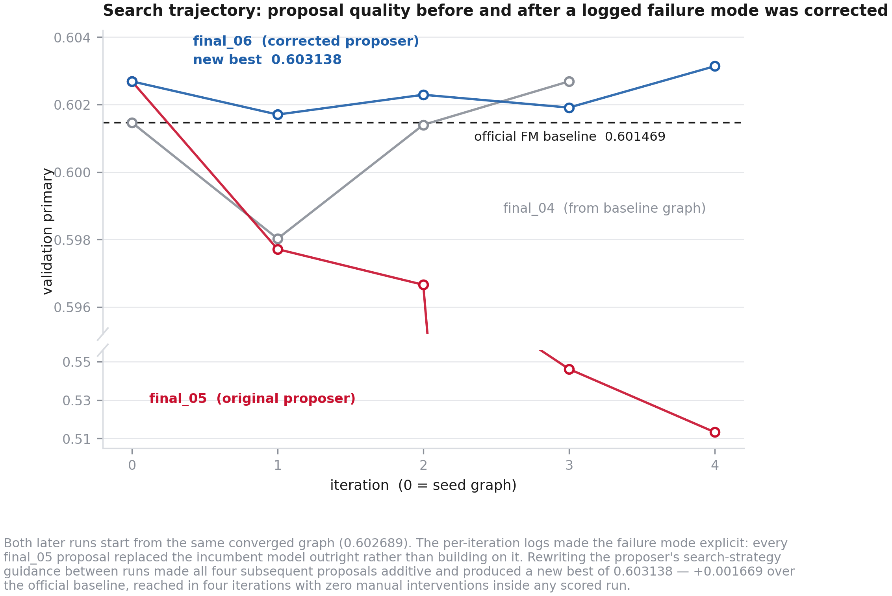

# TechJam 2026 — Autonomous ML Research Agent (Track 2, KuaiRand-Pure)

A typed operator-graph agent that reproduces the official KuaiRand-Pure baseline
exactly, then improves on it autonomously. Every scored run below executed
unattended, start to finish, with **zero manual interventions**.

## Result

The scored run is `final_06`. It converged under the organisers' published rule
(ε = 0.002, N = 3) after four iterations.

| metric | agent | official baseline | absolute delta |
|---|---:|---:|---:|
| GAUC | 0.669639 | 0.6674 | **+0.002239** |
| nDCG@5 | 0.536636 | 0.5357 | **+0.000936** |
| primary | 0.603138 | 0.6016 | **+0.001538** |

Per the judging formula, `score_dataset = mean over m of delta(m)` = **+0.001588**.

Against our own exact seed-0 reproduction of the baseline pipeline
(0.6014687563529677) the primary delta is **+0.001669**.

Read the numbers against the attainable range, not against 1.0: 27.1% of users
have no positive label and 9.2% are all-positive, so perfect ranking reaches
primary 0.8645 and random sits at 0.4753. The official baseline already captures
about 31% of that range.

| resource | value |
|---|---:|
| manual interventions | **0** |
| iterations used | 4 of 50 |
| agent wall-clock | 0.96 h of the 6 h ceiling |
| LLM tokens | 17,063 in + 2,148 out = 19,211 |
| GPU-hours | 0 — the converged graph is a NumPy factorisation machine |

Submission: `runs/final_06/best/submission.csv`, verified by the starter kit's
unmodified `submit.py --check`.



Four scored runs are retained in full under `runs/`. `report/run_log_final_06.md`
carries the per-iteration hypotheses, graph diffs, metrics, and recovery events;
sibling files cover `final_03` through `final_05`.

## What the agent found

The converged graph is a factorisation machine over raw categorical fields, the
static user/video side-file bundle, and a strictly-historical user-by-author
affinity feature. Two of its four accepted moves are worth naming:

- **`add_static_side_features_to_fm` (+0.001220).** The KuaiRand side files carry
  30 user and 62 item columns that the baseline never touches. Hand testing had
  paired that bundle with LightGBM, measured +0.000084, and written it off; the
  agent paired it with the FM instead and gained fifteen times as much. Feature
  bundles interact with model families differently, and the agent tested a
  pairing the human search had already discarded.
- **`add_author_affinity_to_fm` (+0.001669).** A user-by-author historical
  long-view rate, aggregated strictly over earlier dates. It varies within a
  user, which matters because both scored metrics rank *within* a user: any
  feature constant across a user's impressions cannot change their ordering.

## Authoritative task definition

The problem statement contains conflicting metric descriptions. The starter
kit's unmodified `evaluate.py` is authoritative: the positive label is
`long_view`; the metrics are within-user GAUC and nDCG@5; and primary is their
mean. Recall@50 and `click` are not used for scoring by the supplied evaluator.

`eval/official.py` dynamically imports that file and only normalizes result key
names. It does not reimplement the metrics.

## Phase 1 setup

Use Python 3.13.7, then create the environment and install the pinned direct
dependencies:

```bash
python3 -m venv .venv
.venv/bin/python -m pip install -r requirements.txt
```

On Apple Silicon, LightGBM also needs the OpenMP runtime:

```bash
brew install libomp
```

Place the downloaded assets at:

```text
data/starter-kit/evaluate.py
data/starter-kit/baseline.py
data/starter-kit/submit.py
data/starter-kit/data.py
data/kuairand-pure/data/log_standard_4_08_to_4_21_pure.csv
data/kuairand-pure/data/log_standard_4_22_to_5_08_pure.csv
data/kuairand-pure/data/log_random_4_22_to_5_08_pure.csv
data/kuairand-pure/data/user_features_pure.csv
data/kuairand-pure/data/video_features_basic_pure.csv
data/kuairand-pure/data/video_features_statistic_pure.csv
```

Run the Phase 1 acceptance gate with one command:

```bash
make phase1-gate
```

It uses the official loader to verify train/validation/test row counts, runs
`baseline.py --model fm` for seeds 0–4, requires the published five-seed mean at
four decimal places, creates a test submission, and calls the kit's
`submit.py --check` on it. The passing artifact is written to
`runs/phase1/submission.csv`.

The checker rejects a wrong header, a row-count mismatch, non-contiguous
`row_id`, user/video misalignment, non-numeric scores, and NaN/Inf. Later
pipeline execution must delegate every candidate submission to this checker.

The starter kit's published validation baseline (GAUC 0.6674, nDCG@5 0.5357,
primary 0.6016) is the five-seed mean. On the M4 Pro/NumPy 2.5.2 environment,
the default seed-0 command is deterministic at 0.6671 / 0.5358 / 0.6015; seeds
0–4 average to the published values exactly at the kit's four-decimal reporting
precision. The gate preserves this distinction instead of treating seed noise as
a setup failure.

Run the fast contract tests with:

```bash
make test
```

Archive and starter-kit checksums recorded during the passing run are in
`data/README.md`.

## Phase 2 operator graph

Pipelines are JSON DAGs whose nodes and edges are validated before any model
compute. `pipeline/registry.py` declares the input signature, output type, and
callable for every supported node. Validation rejects duplicate IDs, unknown
types, missing inputs, cycles, arity errors, and edge-type mismatches.

The implemented node surface is:

- `data.load`
- `features.raw_categorical`, `features.user_history`,
  `features.item_popularity`, `features.user_category_affinity`,
  `features.video_duration`, `features.temporal`
- `model.fm_baseline`, `model.lightgbm_binary`, `model.lightgbm_rank`,
  `model.torch_deepfm`, `model.torch_multitask`
- `ensemble.rank_average`, `ensemble.seed_bag`
- `submit.rank`

Historical feature builders follow the fixed
`build(train_df, target_df, ctx)` contract and use only training rows with dates
strictly earlier than each target date. `submit.rank` writes the candidate and
delegates validation to the starter kit's unmodified `submit.py --check`.

Run the Phase 2 acceptance gate with:

```bash
make phase2-gate
```

It executes the three hand-written `configs/phase2_*.json` graphs and requires
three distinct official validation scores plus three checker-valid submissions.
The FM-equivalent starting point for later agent phases is
`configs/pipeline_seed.json`. Results are written to
`runs/phase2/results.json`.

## Phase 3 guards

Every feature column now carries explicit source and temporal lineage. Before a
model node can run, `guards/leakage.py` rejects:

- same-row use of `is_click`, `play_time_ms`, `is_like`, `is_follow`,
  `is_comment`, `is_forward`, `long_view`, and the other impression outcomes;
- generated feature columns with missing lineage;
- randomized-exposure features that cannot prove their source rows end on or
  before the training cutoff (`20220421`).

Prior-date aggregates of those outcomes remain valid, and the multi-task model
accesses them through the explicitly checked auxiliary-label path rather than as
features. Validation primary above 0.80 triggers a separate empirical leakage
rejection. Every rejection is appended to the run JSONL before raising.

`guards/sandbox.py` captures combined stdout/stderr, enforces a wall-clock
timeout (900 seconds by default), and caps memory with `RLIMIT_AS` on Linux or
supervised-process RSS monitoring on macOS. A structured result is written beside the
stdout log for both success and failure.

Candidate acceptance uses a strict 2σ threshold of 0.0016. A smaller raw delta
can pass only after exactly three seed runs whose mean improves on the incumbent
and where at least two seeds improve.

Run the Phase 3 gate with:

```bash
make phase3-gate
```

It proves that a deliberately leaky graph is rejected before its model callback,
and that a deliberately broken graph is contained and logged by the sandbox.

## Phase 4 autonomous loop

The harness and the scored run are separate. The production entry point is:

```bash
python -m agent.run --config configs/run.yaml --run-id final_01
```

It initializes the seed graph, caches node-level ablations by topology, and uses
the highest-impact ablated component as an outer-loop target. The default live
config explores four schema-constrained variants of that component before
moving to another target; convergence advances only once per completed outer
group. Each candidate is validated and executed in the Phase 3 sandbox, receives
at most three bounded repair attempts, and is accepted or reverted under the
2σ/three-seed significance rule. The proposer receives only the graph, ablation
evidence, ten recent outcomes, and rejected hypothesis IDs—never raw competition
data.

Graph validation also requires every node output to reach the single terminal
submission, preventing successful-looking runs with discarded feature or model
branches.

Live proposals use OpenAI Responses structured outputs with the strict Pydantic
`Hypothesis` schema. `configs/run.yaml` uses `gpt-5.6-terra` at low reasoning for
proposals and the cheaper `gpt-5.6-luna` for repairs. The API key is read only
from `OPENAI_API_KEY`; it is never stored in configuration. Exact input/output
token usage is copied from each API response into the iteration and cumulative
logs.

Free-form generation is limited to `register_feature`. Its source must define
exactly `build(train_df, target_df, ctx)`, while its declared source columns and
temporal scope become mandatory Phase 3 lineage. All other proposals are typed
parameter or topology mutations: `replace_params`, `add_node`, `remove_node`,
and `rewire`.

Use the deterministic acceptance gate to exercise the orchestration without an
API call or model training:

```bash
make phase4-gate
```

It runs five consecutive unattended iterations with canned hypotheses ordered
by expected effect size. One hypothesis deliberately fails and is recovered on
the first repair attempt; the final two small deltas are rejected after their
three-seed checks. The gate requires zero interventions, zero tokens, a complete
JSONL record for every iteration, and the four per-iteration artifacts. Its
result is written under `runs/phase4_gate/` (gitignored).

`--dry-run` swaps live proposal and repair calls for canned hypotheses while
retaining the evaluator selected by the config. Use `configs/phase4_gate.yaml`
when both proposal and evaluation must be synthetic. Synthetic metrics are
marked and exist only to verify loop control; they are never competition results.

During a scored run, append every manual action to the run's
`interventions.jsonl` with a timestamp, action, and reason. The runner creates
the file but never silently claims that later human actions did not happen.

## Reproducing the scored run

Requires Python 3.13, the KuaiRand-Pure data and unmodified starter kit under
`data/` (paths in *Phase 1 setup* above), and `OPENAI_API_KEY` in the
environment. The key is read only from the environment and never written to
configuration or logs.

```bash
python3 -m venv .venv-phase5
.venv-phase5/bin/python -m pip install -r requirements.txt
.venv-phase5/bin/python -m pytest -q            # 60 tests, no data or network needed
```

Reproduce the scored run end to end (≈1 h, no GPU required):

```bash
bash scripts/run_scored.sh final_06 configs/run_final06.yaml 1
```

Regenerate every reported artifact from the run directory, so no number in the
report is transcribed by hand:

```bash
.venv-phase5/bin/python report/make_deliverables.py final_06   # run log + results + resources
/opt/conda/bin/python  report/make_figures.py                  # the three figures
```

Verify the submission with the organisers' own checker:

```bash
cd data/starter-kit && python3 submit.py --check --split test \
    --data_dir ../kuairand-pure/data ../../runs/final_06/best/submission.csv
```

Two notes on exact reproduction. Proposals come from a sampled LLM, so a fresh
run may take a different search path; the harness, guards, gates, and evaluation
are fully deterministic, and every historical run is retained under `runs/`.
`configs/run_final06.yaml` seeds from `final_04`'s converged graph, so run
`final_04` first if you want the whole chain from the baseline graph upward.

## Limitations, and what I would do with more time

**The convergence rule binds well before the compute budget does.** Every run
stopped at three to five iterations having used under a sixth of the six-hour
ceiling and under a tenth of the fifty-iteration cap. The organisers' ε = 0.002
is calibrated to 2.5σ of the baseline's five-seed standard deviation (0.0008),
but the genuine per-iteration gains available on this benchmark are of that same
order, roughly 0.001. An honest agent making real progress therefore trips the
convergence test before those gains compound. This is the single largest
constraint on the achievable score, and it is a property of the task definition
rather than of the search.

**Seed variance is comparable to the effect sizes being chased.** The FM moves
by about 0.0014 across seeds, while the improvements under test are around
0.001. Single-seed comparisons at this scale are unreliable, which is why
acceptance uses a 2σ threshold with a three-seed confirmation path. Averaging
several seeds of the incumbent is itself worth roughly +0.0012 in offline
measurement — more than any single architectural change tested — and wiring
`ensemble.seed_bag` into the proposer's default repertoire is the first thing I
would do next.

**The proposer explores narrowly.** In `final_05` all four proposals replaced the
incumbent model outright and all four lost, down to 0.513. Rewriting the
search-strategy guidance between runs fixed the symptom and produced the scored
result, but the underlying behaviour — a strong prior toward swapping the model
rather than composing around it — deserves a structural fix, such as typed
proposal classes with an explicit exploration budget per class.

**Ensembling is reachable but unexercised.** `ensemble.rank_average` and
`ensemble.seed_bag` are registered and tested, yet no autonomous run has used
them. Offline experiments show a rank-average of decorrelated models beating
either component, including cases where a model that is weaker alone still earns
weight. That is unclaimed headroom inside the existing operator set.

**Scope deliberately not attempted.** The randomised-exposure log overlaps the
evaluation window, so IPS and doubly-robust correction were ruled out rather than
risked; the guard enforces this. The bonus KuaiRand-1k and -27k benchmarks were
not attempted, which by the published rules costs nothing on the required
benchmark. Duration deconfounding in the style of D2Q (KDD 2022) was considered
and rejected on principle: `long_view` *is* the scored label here, so duration
carries signal the metric rewards rather than bias to be removed.

## Contributions

Solo entry. All harness, operator, guard, evaluation, and report code is my own,
written against the unmodified starter kit. `data/starter-kit/evaluate.py`,
`data.py`, `baseline.py`, and `submit.py` are the organisers' files and are
imported rather than reimplemented, so the scoring path is theirs end to end.
